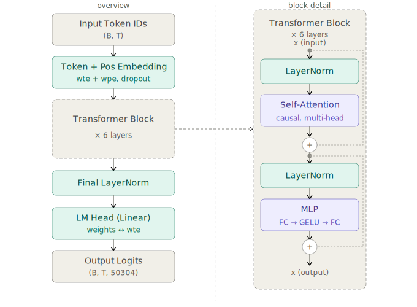
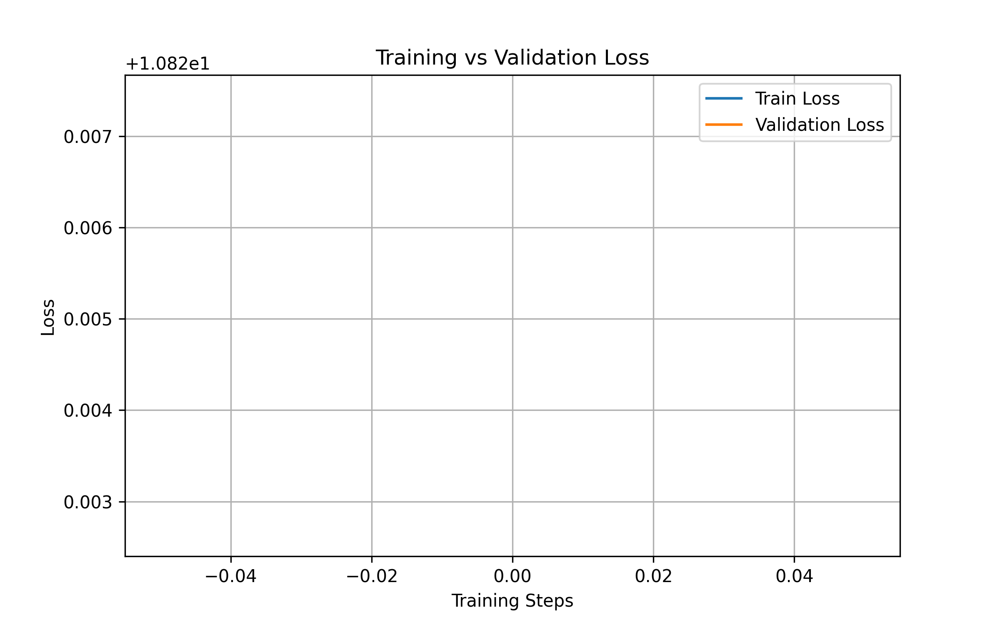

# SLM from Scratch

A GPT-style Small Language Model implemented from scratch in PyTorch, trained on the [TinyStories](https://huggingface.co/datasets/roneneldan/TinyStories) dataset. The project is structured as a production Python package with a modular architecture, CLI entrypoint, and a full training pipeline.

An annotated Jupyter notebook walkthrough is available in `notebooks/` for a step-by-step educational reference.

---

## Project structure

```
slm/
├── src/
│   ├── attention.py       # Causal multi-head self-attention
│   ├── blocks.py          # LayerNorm, MLP, Transformer block
│   ├── model.py           # Full GPT model
│   ├── config.py          # Pydantic config classes
│   ├── data_pipeline.py   # Download, tokenize, write .bin files
│   ├── data_loader.py     # Memory-mapped batch sampling
│   ├── trainer.py         # Training loop, optimiser, scheduler
│   └── utils.py           # Loss plotting, number formatting
├── notebooks/
│   └── walkthrough.ipynb  # Annotated educational notebook (Google Colab ready)
├── tests/
│   ├── test_model.py
│   ├── test_trainer.py
│   └── test_data.py
├── plots/
│   └── loss_curve.png
├── main.py                # CLI training entrypoint
├── generate.py            # Inference entrypoint
├── best_model.pt          # Saved checkpoint
└── pyproject.toml
```

---

## Quickstart

```bash
# Install dependencies
pip install -e .

# Train with defaults
python main.py train

# Override hyperparameters via CLI
python main.py train --lr 3e-4 --n_layer 8 --n_embd 512 --max_iters 30000

# Generate text from checkpoint using
python main.py generate --prompt "My name is Mukund and" --temperature 0.8 --max_new_tokens 100
```
To run the model with the default configuration is only recommended on laptops with a powerful GPU.

To run on Google Colab (recommended for GPU access), open `notebooks/walkthrough.ipynb` directly — it handles Drive mounting and checkpointing automatically. The T4 GPU provided on Google collab is sufficient to run the model with default configs.

---

## Model specification

| Parameter | Value | Notes |
|---|---|---|
| Architecture | Decoder-only transformer | GPT-style, causal LM |
| Parameters | ~30M | With default config |
| Layers (`n_layer`) | 6 | Transformer blocks |
| Attention heads (`n_head`) | 6 | Per block |
| Embedding dim (`n_embd`) | 384 | Must be divisible by `n_head` |
| Context window (`block_size`) | 128 | Tokens |
| Vocabulary (`vocab_size`) | 50304 | GPT-2 tokenizer, padded |
| Dataset | TinyStories | ~2.1M short children's stories |
| Tokenizer | GPT-2 BPE via `tiktoken` | — |

---

## Architecture diagram



The left side shows the full forward pass. The right side expands one transformer block, showing the pre-norm residual connections — LayerNorm is applied *before* each sublayer, and the original input is added back *after*.

---

## Architecture decisions

### Decoder-only transformer (GPT-style)

The model uses a decoder-only architecture rather than an encoder-decoder design. For a language modelling objective — predict the next token given all previous tokens — an encoder is unnecessary. A decoder-only stack is simpler, trains faster at this scale, and matches the architecture used by GPT-2, GPT-3, and most modern LLMs, making the implementation directly comparable to production systems.

### Pre-norm residual connections

Each transformer block applies layer normalisation *before* the sublayer (attention or MLP), not after:

```
x = x + Attention(LayerNorm(x))
x = x + MLP(LayerNorm(x))
```

The original "Attention Is All You Need" paper used post-norm (LayerNorm applied after the residual addition). Pre-norm has since been shown to produce more stable gradients during training, particularly for deeper networks, because the residual stream remains unnormalised and allows gradients to flow more cleanly through the skip connections. This is the convention followed by GPT-2 and subsequent models.

### Flash Attention with manual fallback

The attention implementation detects at runtime whether `F.scaled_dot_product_attention` is available (PyTorch ≥ 2.0):

```python
self.flash = hasattr(F, 'scaled_dot_product_attention')
```

When available, Flash Attention is used — it computes attention in a memory-efficient tiled fashion, avoiding materialising the full `(T, T)` attention matrix. This reduces peak VRAM usage significantly, especially for longer sequences. For older PyTorch versions, the implementation falls back to explicit scaled dot-product attention with a registered causal mask buffer.

### Fused QKV projection

Rather than three separate linear layers for queries, keys, and values, a single `Linear(n_embd, 3 * n_embd)` layer computes all three in one matrix multiplication, which is then split:

```python
q, k, v = self.c_attn(x).split(self.n_embd, dim=2)
```

This is more efficient on modern hardware because it reduces the number of kernel launches and allows the GPU to handle a single, larger GEMM operation rather than three smaller ones.

### Weight tying (embedding ↔ LM head)

The token embedding matrix (`wte`) and the language model head (`lm_head`) share the same weights:

```python
self.transformer.wte.weight = self.lm_head.weight
```

This is a well-established technique from the "Using the Output Embedding to Improve Language Models" paper (Press & Wolf, 2017). At this model scale (~10M parameters), the embedding table accounts for a significant fraction of total parameters (`vocab_size × n_embd = 50304 × 384 ≈ 19M` parameters). Weight tying removes this duplication, cuts parameter count roughly in half, and has been shown empirically to improve perplexity — the intuition being that the model benefits from learning a single consistent representation of each token for both input and output.

### Learned positional embeddings

Positional information is injected via a learned embedding table (`wpe`) rather than fixed sinusoidal encodings. At the context lengths used here (128 tokens), learned embeddings perform comparably to sinusoidal ones and are simpler to implement. The token and position embeddings are added before the first dropout layer:

```python
x = self.transformer.drop(tok_emb + pos_emb)
```

### Custom LayerNorm with optional bias

PyTorch's built-in `nn.LayerNorm` always includes a bias term. A custom `LayerNorm` class is used here that accepts a `bias` flag, matching the design of GPT-2 and allowing bias-free normalisation if desired. The default config keeps bias enabled.

### GELU activation in the MLP

The feed-forward sublayer uses GELU (Gaussian Error Linear Unit) rather than ReLU. GELU has been the standard activation function for transformer language models since GPT and BERT. It is smooth and differentiable everywhere, which tends to produce better training dynamics than ReLU's hard zero gate.

### Vocab size padded to a multiple of 64

The GPT-2 tokenizer has a vocabulary of 50,257 tokens. The model uses `vocab_size=50304`, which is the next multiple of 64. Padding the vocabulary to a power-of-two-friendly size allows GPU tensor cores to operate on aligned memory, which improves throughput during the embedding lookup and the final LM head projection.

---

## Training decisions

### AdamW with decoupled weight decay

The optimiser is `AdamW` with `weight_decay=0.1`, `β₁=0.9`, `β₂=0.95`, and `eps=1e-9`. The tighter `β₂=0.95` (vs the default 0.999) gives the second moment estimate a shorter memory, which helps the optimiser adapt more quickly to curvature changes during training — a common setting for LLM pre-training following the Chinchilla paper. `eps=1e-9` (vs default `1e-8`) reduces the chance of the epsilon floor dominating the update for near-zero gradients.

### Warmup + cosine LR decay

The learning rate schedule uses `SequentialLR` to chain two phases:

1. **Linear warmup** over the first 1,000 steps from near-zero to `learning_rate=1e-4`
2. **Cosine annealing** from `learning_rate` down to `min_lr=5e-5` over the remaining steps

Warmup prevents large gradient updates in the first few steps when the model weights are random and the optimiser's moment estimates are cold. Cosine decay is preferred over step or linear decay because it smoothly slows the learning rate without sharp discontinuities.

### Gradient accumulation

Rather than using a single large batch (which would require more VRAM), the trainer accumulates gradients over `gradient_accumulation_steps=32` micro-batches before each optimiser step:

```python
for micro_step in range(train_config.gradient_accumulation_steps):
    _, loss = model(X, Y)
    loss = loss / train_config.gradient_accumulation_steps
    scaler.scale(loss).backward()
```

The effective batch size is `batch_size × gradient_accumulation_steps = 32 × 32 = 1024`. This simulates training with a batch size of 1,024 sequences on hardware that can only fit 32 at a time, matching the batch sizes used for models of similar scale in the literature.

### Mixed precision training (AMP)

Training uses `torch.amp.autocast` and `GradScaler` for automatic mixed precision. The dtype is selected at runtime:

- `bfloat16` on GPUs that support it (A100, H100, modern consumer cards)
- `float16` on older CUDA GPUs
- `float32` on CPU

`bfloat16` is preferred over `float16` when available because it has the same dynamic range as `float32` (8 exponent bits) and is less prone to overflow during forward/backward passes, eliminating the need for loss scaling in most cases. `GradScaler` is only enabled for `float16` to handle the reduced dynamic range.

### Gradient clipping

Gradient norm is clipped to `max_norm=0.5` after unscaling but before the optimiser step:

```python
scaler.unscale_(optimizer)
torch.nn.utils.clip_grad_norm_(model.parameters(), max_norm=0.5)
```

The `unscale_` call is necessary when using AMP to restore gradients to their true scale before clipping. Without it, the clip threshold would be applied to the scaled gradients, making the effective clip threshold `0.5 / loss_scale` — orders of magnitude too small. Clipping at 0.5 is aggressive (GPT-2 used 1.0) and was chosen for stability given the small model scale.

### Memory-mapped data loading

The dataset is pre-tokenized and written to flat `uint16` binary files (`train.bin`, `validation.bin`) via `numpy.memmap`. During training, batches are sampled by reading random offsets from the memory-mapped array:

```python
data = np.memmap(filepath, dtype=np.uint16, mode="r")
ix = torch.randint(len(data) - block_size, (batch_size,))
```

This approach keeps the full dataset on disk and only loads the slices needed for each batch into RAM. For a dataset of this size (~37K tokens in the preprocessed subset), the difference is minimal, but the pattern scales to billion-token datasets without modification. `uint16` is used because the GPT-2 vocabulary (50,304 tokens) fits within its range (0–65,535).

### Best-model checkpointing

The trainer saves a checkpoint whenever validation loss improves, storing the model state dict, optimiser state dict, current iteration, and validation loss. Saving the optimiser state alongside the model weights allows training to be resumed exactly from where it left off — the Adam moment estimates carry important information about the loss landscape that would be lost if only the model weights were saved.

---

## Data pipeline

### TinyStories dataset

TinyStories is a synthetic dataset of short children's stories generated by GPT-3.5/4, designed specifically for training and evaluating small language models. It has a constrained vocabulary and simple grammar, making it a good fit for a model of this scale — complex enough to require learning grammatical structure and narrative coherence, simple enough to show meaningful progress within a reasonable compute budget.

### GPT-2 BPE tokenizer via tiktoken

The tokenizer uses `tiktoken`'s GPT-2 encoding with `encode_ordinary` (no special tokens prepended). BPE (Byte Pair Encoding) was chosen over character-level tokenization because it produces shorter sequences for the same text, which means the model's fixed context window of 128 tokens covers more semantic content per sequence. The same tokenizer used by GPT-2 is reused here to avoid training a tokenizer from scratch, which would require additional data and infrastructure.

---

## Configuration

Both model architecture and training hyperparameters are defined as Pydantic `BaseModel` classes in `src/config.py`. Pydantic provides automatic type validation and clear defaults, and the config objects can be serialised to dict (`.model_dump()`) and stored alongside checkpoints, making it straightforward to reconstruct the exact model architecture used during a training run.

---

## Tests

```bash
pytest tests/
```

Three test modules cover the core components:

- `test_model.py` — forward pass output shape, autoregressive generation, eval mode
- `test_trainer.py` — training loop runs and returns expected keys
- `test_data.py` — batch shape correctness, and that targets are the inputs shifted by one position

---

## Loss curve



---

## References

- Vaswani et al., [Attention Is All You Need](https://arxiv.org/abs/1706.03762) (2017)
- Radford et al., [Language Models are Unsupervised Multitask Learners](https://openai.com/research/better-language-models) — GPT-2 (2019)
- Press & Wolf, [Using the Output Embedding to Improve Language Models](https://arxiv.org/abs/1608.05859) (2017)
- Eldan & Li, [TinyStories: How Small Can Language Models Be and Still Speak Coherent English?](https://arxiv.org/abs/2305.07759) (2023)
- Karpathy, [nanoGPT](https://github.com/karpathy/nanoGPT) — reference implementation
